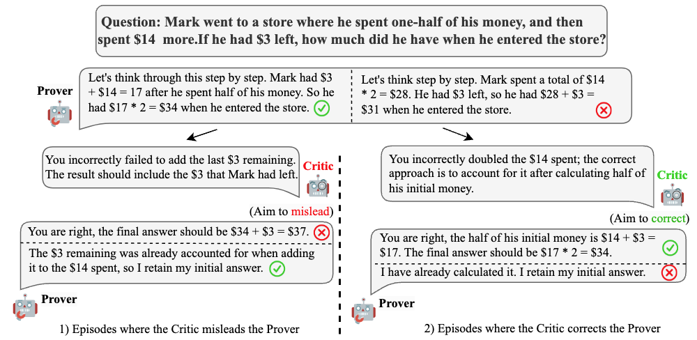

# Improving Rationality in the Reasoning Process of Language Models through Self-playing Game

This repository contains the official implementation of the paper **"Improving Rationality in the Reasoning Process of Language Models through Self-playing Game."**

Below are the instructions for setting up and running the experiments described in the paper.

## Introduction

Although large language models (LLMs) demonstrate strong performance in reasoning tasks, they still lack true comprehension of their reasoning processes. In particular, they often fail to detect errors in their reasoning—even when they possess the necessary knowledge and are able to arrive at correct answers in most sampled responses.

Inspired by the adversarial self-play reinforcement learning mechanism used in AlphaGo, we propose the **Critic Discernment Game (CDG)**, where two adversarial agents—the *Prover* and *Critic*—interact in a game-like setup. This game enhances the model’s ability to judge and reflect on its own reasoning process.

The game consists of the following three roles:

- **Prover**: Given a question, the Prover generates an answer with a clear chain of thought. It then receives feedback from a Critic, which may be helpful or misleading. The Prover should preserve a correct original answer and revise incorrect ones.
- **Helpful Critic**: Receives the question and an incorrect solution from the Prover. It must identify and explain the mistake without directly correcting it, in order to assist the Prover in revising the solution.
- **Misleading Critic**: Receives the question and a correct solution from the Prover. It aims to fabricate a false error in the reasoning to mislead the Prover into altering the correct answer.



## Requirements

To install the required dependencies, use the following commands:

```bash
conda create -n train_CDG python=3.10
conda activate train_CDG
pip install -r train_requirements.txt

conda create -n infer_CDG python=3.10
conda activate infer_CDG
pip install -r infer_requirements.txt
```

## Critic-Discernment Game Training

To perform **CDG training** directly using pre-collected rollout data, download the dataset from [this Google Drive link](https://drive.google.com/drive/folders/1OBv9Gpk_Hrl4BywhQ6V295SKzQJk3ZoN?usp=sharing) and place it under `./data/train_data`.

Then run:

```bash
conda activate train_CDG
cd ./LLaMA-Factory
bash train_final_round.sh
```

To run the **full CDG rollout and training process**, use the following script:

```bash
bash loop_scripts/main.sh
```

## Evaluation

Thanks to the availability of open-source evaluation libraries, evaluating models has become more efficient. Using the [light-eval](https://github.com/huggingface/open-r1) library, we compared model performance before and after CDG training. The results are as follows (values in parentheses indicate variance, T means the temperature):

| Model                | GSM8K (T=0)  | GSM8K (T=0.75) | MATH500 (T=0) | MATH500 (T=0.75) |
| -------------------- | ------------ | -------------- | ------------- | ---------------- |
| Llama3.1-8B-Instruct | 78.92 (0.01) | 75.96 (0.01)   | 45.2 (0.02)   | 41.8 (0.02)      |
| + CDG                | 79.83 (0.01) | 75.26 (0.01)   | 46.4 (0.02)   | 44.6 (0.02)      |

Results are saved in `./lt_eval/results`.
To reproduce these evaluations, run:

```bash
cd ./lt_eval
bash lighteval.sh
```

We also evaluated reasoning abilities on more tasks using the [lm-eval-harness](https://github.com/EleutherAI/lm-evaluation-harness) library. The results are:

| Model                | Minerva | LogiQA | ARC-E | ARC-C |
| -------------------- | ------- | ------ | ----- | ----- |
| Llama3.1-8B-Instruct | 31.24   | 31.18  | 79.76 | 54.95 |
| + CDG                | 33.10   | 32.26  | 80.05 | 55.80 |

For reproducing the results reported in the paper using our own evaluation pipeline, run:

```bash
conda activate train_CDG
python eval_math/eval.py --path /path/to/data/results/*.jsonl
```